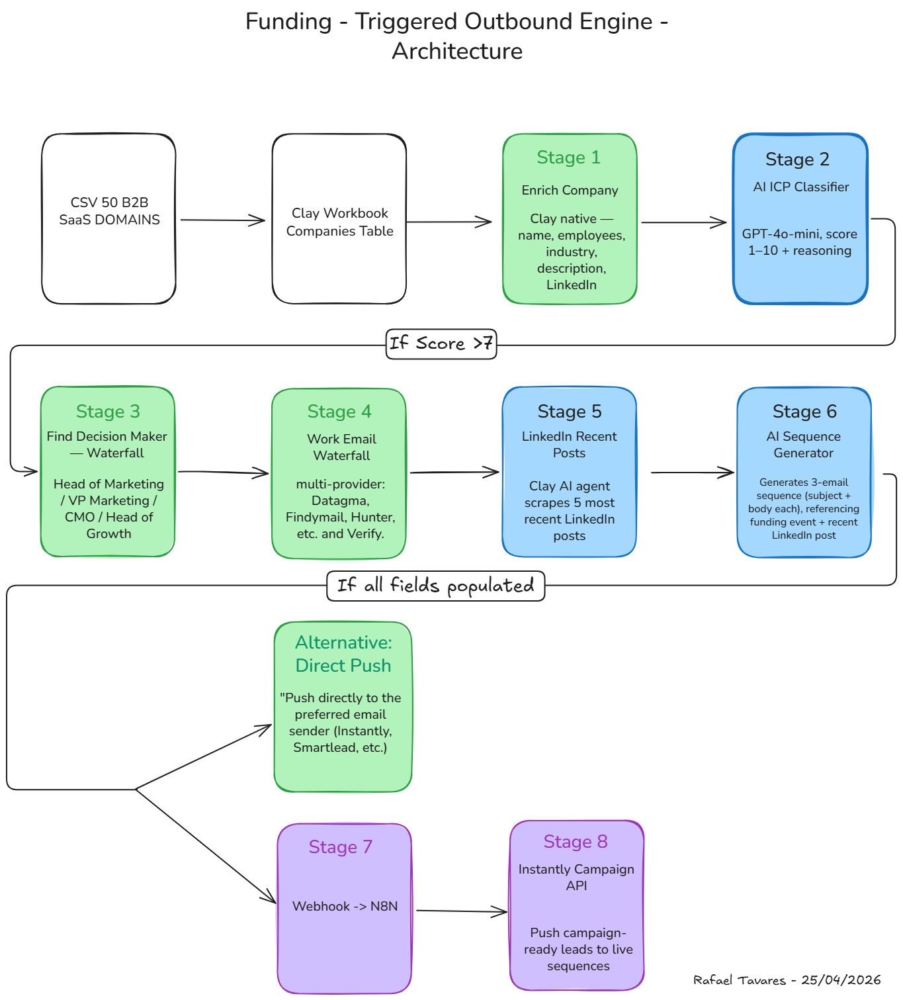

# Funding-Triggered Outbound Engine

## Thesis

B2B companies that just raised Series A or Series B sit in a 30-day budget urgency window — investors push them to scale, budgets are approved, and they're actively buying tools and services. Triggered outbound in this window converts 3-5x better than batch-and-blast cold traffic.

This pipeline operationalizes that signal end-to-end: from funding-event detection to campaign-ready leads in Instantly.

## Architecture

## Stages

1. **Source** — B2B SaaS target list (Crunchbase / TechCrunch / Sifted feed)
2. **Enrich Company** — Clay native: name, employees, industry, description, LinkedIn, HQ
3. **AI ICP Classifier** — GPT-4o-mini scores fit 1-10 with reasoning. Rows scoring <7 skip downstream enrichment.
4. **Find Decision-Maker — Waterfall** — Multi-provider waterfall filtered by Head of Marketing / VP Marketing / CMO / Head of Growth
5. **Work Email Waterfall** — Datagma → Findymail → Hunter → Verify. Verified emails only.
6. **LinkedIn Recent Posts** — AI agent scrapes 5 most recent posts from the decision-maker for hook material
7. **AI Sequence Generator** — GPT-4o-mini generates 3-email sequence (subject + body each), referencing both funding event and recent LinkedIn activity
8. **Instantly Push** — Webhook → N8N transforms data → conditional push to Instantly Campaign API if all fields populated

## Key Engineering Decisions

- **Conditional ICP gate (Stage 2 → 3):** Skips expensive downstream enrichment on rows scoring <7. Reduces enrichment cost ~30% on a representative target list.
- **Conditional Instantly push (Stage 7 → 8):** Only campaign-ready leads (all fields populated) sync to Instantly. Keeps campaign data clean and prevents broken sends.
- **Signal specificity:** Every generated message references both the funding signal AND the decision-maker's recent LinkedIn activity. Two-source personalization improves response rates over funding-only references.
- **Verified emails only:** Stage 5 includes verification, not just discovery. Unverified emails get dropped before reaching Stage 8.

## Results

*To be added after Sunday production run.*

- Companies processed: 50
- Company enrichment match rate: [X]%
- Decision-maker identified: [X]%
- Verified email match rate: [X]%
- Campaign-ready leads: [X] / 50
- End-to-end pipeline time: [X] minutes

## Stack

Clay · N8N · GPT-4o-mini · Instantly API

## Demo

*Loom walkthrough link added Sunday.*

## Case Study

*Full case study link added Sunday.*
